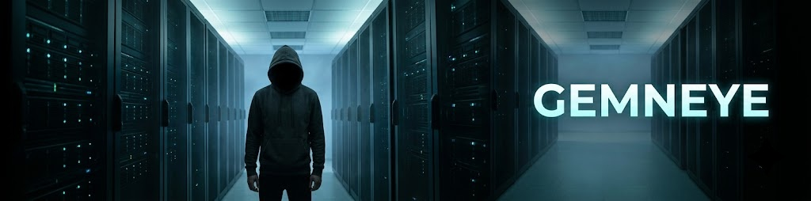

<!-- Gemneye · github.com/sruckh · profile README -->

 

# 👁️ Gemneye

### *I make machines talk, see, and occasionally behave.*

I build the plumbing behind generative AI, ship it in a container, and disappear.  No keynote, no thread, no "excited to announce."  Just a repo and a README that's better than this one used to be.

Most people wait for the future.  I'd rather clone it, `docker compose up`, and find out at 2am whether it actually works.  My stuff lives at the intersection of **voice synthesis, computer vision, and serverless GPUs** — I take whatever model dropped on Hugging Face this week and turn it into something you can deploy tonight, before it's cool, before the README exists.

107 repos.  Mostly Python.  Always on a GPU.  Rarely documented properly — I'm working on it.

*Currently: turning this week's Hugging Face drop into a serverless endpoint nobody asked for.*

 

---

### 🔊 Voice — teaching machines to talk in anyone's accent
Zero-shot voice cloning, multilingual TTS, speech recognition, voice conversion.  All packaged as serverless endpoints, because I'm not paying for a GPU to sit idle and think about its life choices.

- 🌟 **[Qwen3-TTS-finetune](https://github.com/sruckh/Qwen3-TTS-finetune)** — one command, custom voice.  No PhD required.
- **[VibeVoice-Serverless](https://github.com/sruckh/VibeVoice-Serverless)** · **[chatterbox-runpod-serverless](https://github.com/sruckh/chatterbox-runpod-serverless)** — zero-shot cloning, 23+ languages, none of which I actually speak
- **[higgs-audio-v2](https://github.com/sruckh/higgs-audio-v2)** — trained on 10M+ hours of audio.  More listening than I've done in my life.
- **[indextts2-runpod](https://github.com/sruckh/indextts2-runpod)** · **[Moss-TTS-Runpod](https://github.com/sruckh/Moss-TTS-Runpod)** · **[VoxCPM-Runpod](https://github.com/sruckh/VoxCPM-Runpod)** · **[LinaCodec-Serverless](https://github.com/sruckh/LinaCodec-Serverless)** — TTS and voice conversion, take your pick
- **[canary-qwen-2.5b-RunPod](https://github.com/sruckh/canary-qwen-2.5b-RunPod)** · **[parakeet-runpod](https://github.com/sruckh/parakeet-runpod)** — speech-to-text that's better at listening than most people I know

### 🎨 Vision — generation, editing, and un-breaking video
Diffusion, image editing, video restoration.  At scale, because doing it one image at a time is for people with patience.

- **[GemFlash](https://github.com/sruckh/GemFlash)** · **[runhub](https://github.com/sruckh/runhub)** — Gemini image pipelines and batch generation
- **[flux.2-klein-base-9b-serverless](https://github.com/sruckh/flux.2-klein-base-9b-serverless)** · **[zimage-serverless](https://github.com/sruckh/zimage-serverless)** · **[qwenimage-runpod](https://github.com/sruckh/qwenimage-runpod)** — image generation with LoRA support built in
- **[SeedVR-RunPod](https://github.com/sruckh/SeedVR-RunPod)** · **[InfiniteTalk](https://github.com/sruckh/InfiniteTalk-Google-Collab)** — video restoration and talking heads that don't look cursed

### 🧠 Tooling — the boring stuff that makes the fun stuff work
- 🌟 **[ClaudeWebUI-Docker](https://github.com/sruckh/ClaudeWebUI-Docker)** — Claude Code, dockerized, because terminals are great until you want a browser tab
- 🌟 **[gemsAPI](https://github.com/sruckh/gemsAPI)** — FastAPI + MCP server for managing LLM system prompts.  This README's tone came from it, actually.
- **[llama.cpp-serverless](https://github.com/sruckh/llama.cpp-serverless)** · **[astral](https://github.com/sruckh/astral)** — inference runtimes and a stars organizer, for people who collect GitHub repos like Funko Pops

### 🫥 The one I don't talk about at dinner
- 🌟 **[RMBanana](https://github.com/sruckh/RMBanana)** — strips invisible AI watermarks off Gemini-generated images via reverse alpha blending.  Some things are best left untraceable.  Just sayn'.

---

*I build the tooling layer of the AI age, one endpoint at a time, and I two-space after every period.  Fight me.*

 

<a href="https://commit-history.com/sruckh">
  <picture>
    <source media="(prefers-color-scheme: dark)" srcset="https://commit-history.com/embed/sruckh?theme=dark" />
    
  </picture>
</a>

